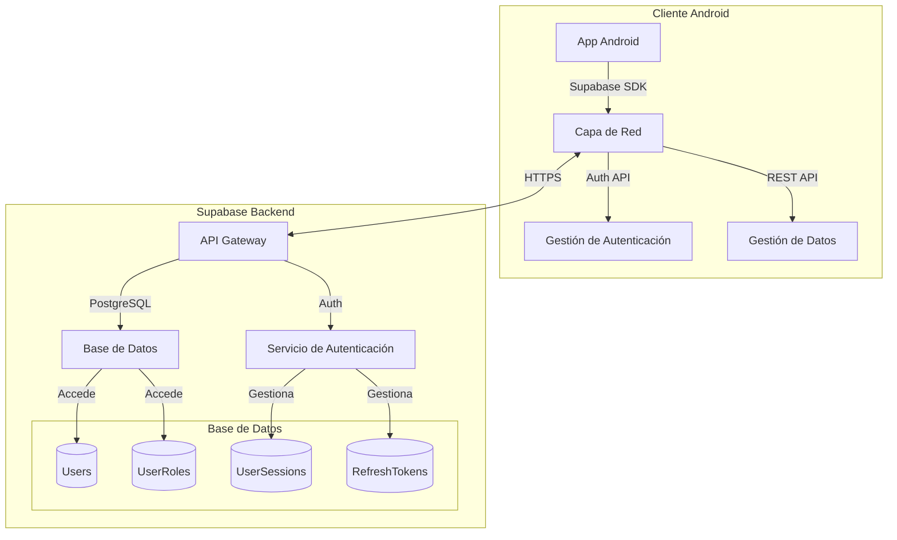

##
# Diagrama de arquitectura Cliente-Servidor


## Definición de los EndPoints del WebService

**Host:** [http://localhost:10050](http://localhost:10050)

| Descripción                 | End-point          | Método | Tipo de petición | Parámetros        |
| --------------------------- | ------------------ | ------ | ---------------- | ----------------- |
| Obtener datos de un usuario | /prototip1/getuser | GET    | application/json | username (string) |

### Obtener datos de un usuario

**Descripción:** Este endpoint permite obtener la información de un usuario específico proporcionando su nombre de usuario.

* **URL de prueba:** `http://localhost:10050/prototip1/getuser?username=usuari1`

#### Respuestas posibles:

* **Código HTTP 200 – Usuario encontrado:**

  ```json
  {
    "email": "prova@gmail.com",
    "id": 1,
    "password": "12345",
    "username": "usuari1"
  }
  ```

* **Código HTTP 400 – Usuario no encontrado:**

  ```json
  {
    "description": "Usuari no trobat",
    "code": 1
  }
  ```

* **Código HTTP 400 – Falta parámetro username:**

  ```json
  {
    "description": "Falta paràmetre Username",
    "code": 2
  }
  ```

* **Código HTTP 500 – Error interno del servidor:**

  ```json
  {
    "description": "Server Error",
    "code": 3
  }
  ```

