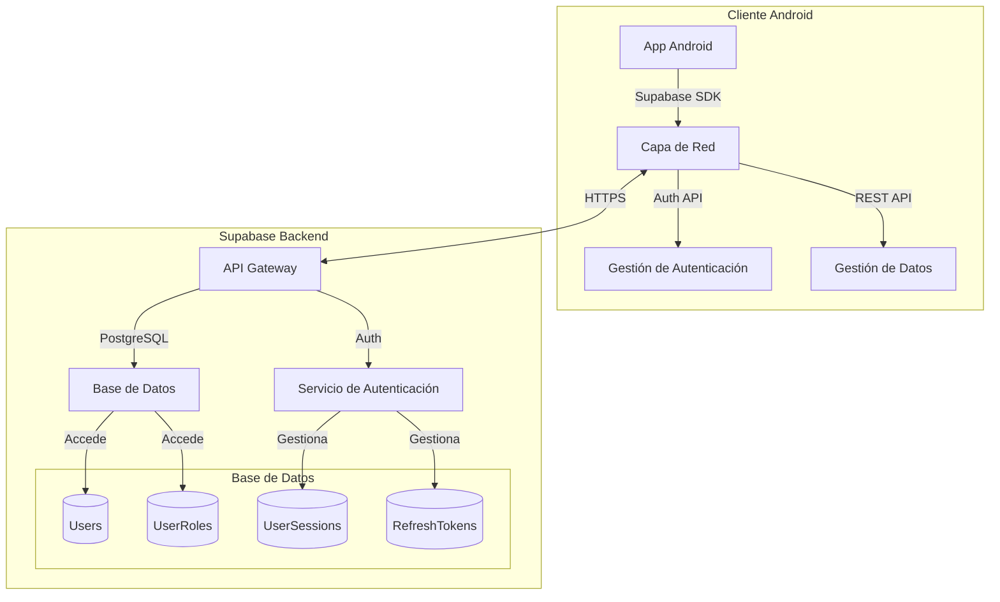

##
# Diagrama de arquitectura Cliente-Servidor

```mermaid
graph TD
    subgraph Cliente[Cliente Android]
        A[App Android] -->|Supabase SDK| B[Capa de Red]
        B -->|Auth API| C[Gestión de Autenticación]
        B -->|REST API| D[Gestión de Datos]
    end

    subgraph Servidor[Supabase Backend]
        E[API Gateway] -->|Auth| F[Servicio de Autenticación]
        E -->|PostgreSQL| G[Base de Datos]
        
        subgraph Base de Datos
            H[(Users)]
            I[(UserRoles)]
            J[(UserSessions)]
            K[(RefreshTokens)]
        end
        
        F -->|Gestiona| J
        F -->|Gestiona| K
        G -->|Accede| H
        G -->|Accede| I
    end

    B <-->|HTTPS| E
```