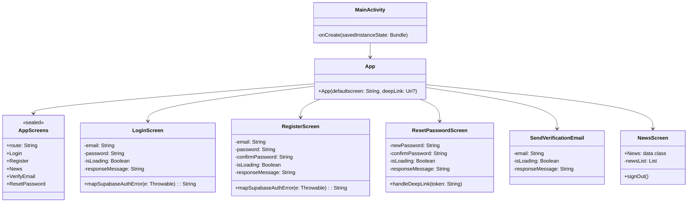
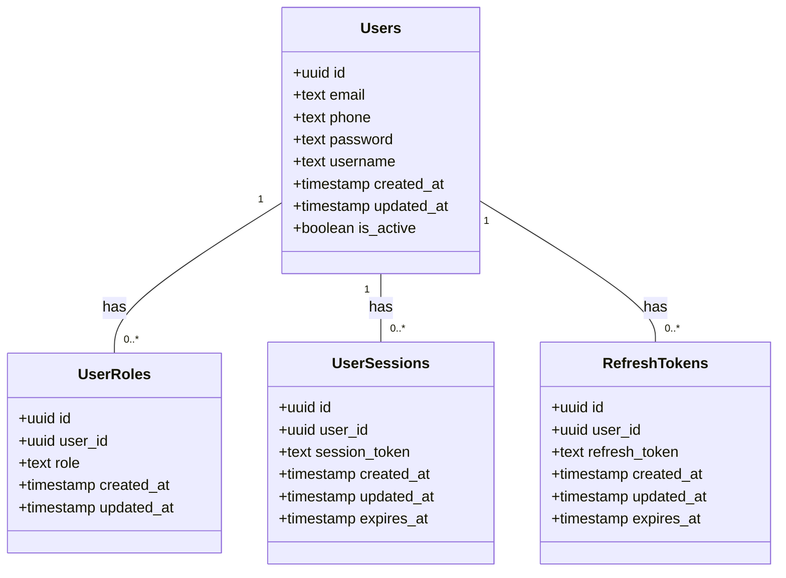

##
# Diagrama de clases Backend(App)

---

# Diagrama de clases Backend(Supabase)
##Es un diagrama de clases basico que representa la estructura de la base de datos de Supabase, incluyendo las tablas y sus relaciones.
