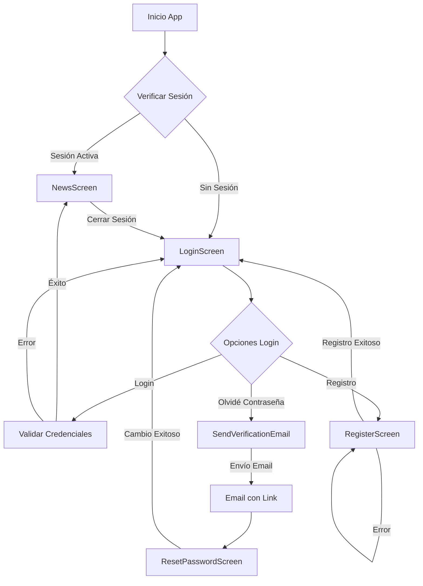

##

```mermaid
graph TD
    A[Inicio App] --> B{Verificar Sesión}
    B -->|Sesión Activa| C[NewsScreen]
    B -->|Sin Sesión| D[LoginScreen]
    
    D --> E{Opciones Login}
    E -->|Login| F[Validar Credenciales]
    E -->|Registro| G[RegisterScreen]
    E -->|Olvidé Contraseña| H[SendVerificationEmail]
    
    F -->|Éxito| C
    F -->|Error| D
    
    G -->|Registro Exitoso| D
    G -->|Error| G
    
    H -->|Envío Email| I[Email con Link]
    I --> J[ResetPasswordScreen]
    J -->|Cambio Exitoso| D
    
    C -->|Cerrar Sesión| D
```